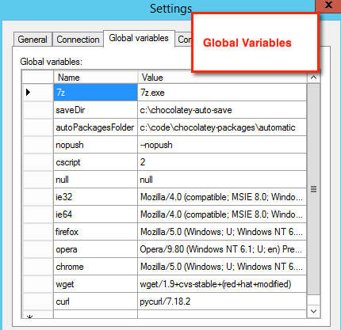
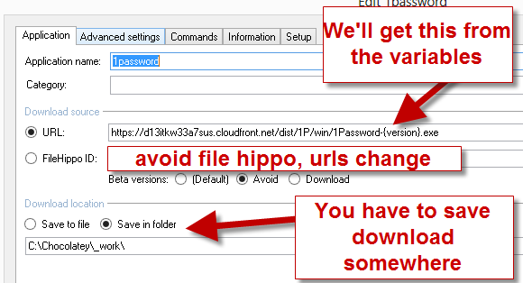
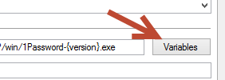
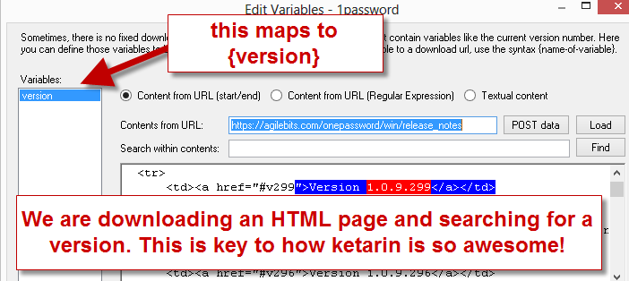
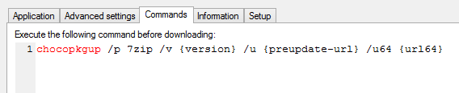
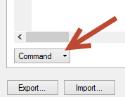

# Empaquetado Automático para Mantenimiento
El empaquetado automático es un proceso que los **mantenedores de paquetes pueden ejecutar por su cuenta** para mantener actualizados sus paquetes. No es un paso forzoso para mantener los paquetes en la fuente de la comunidad (https://chocolatey.org/packages), pero se recomienda que encuentre una forma de automatizar el despliegue de paquetes cuando haya actualizaciones, si va a mantener más de 5 paquetes y usted no es el proveedor de software para estos paquetes.

**NOTA:** No debe confundirse con la función de creación automática de paquetes en [Chocolatey for Business](https://chocolatey.org/pricing) - esa función crea paquetes directamente desde los archivos del instalador. La funcionalidad descrita a continuación, es para el mantenimiento de paquetes de paquetes existentes en el feed de la comunidad.

<!-- TOC -->

- [Métodos de actualización automática](#automatic-update-methods)
- [Actualizador automático (AU)](#automatic-updater-au)
  - [Créditos](#credits)
  - [Requerimientos](#requirements)
  - [Preparación](#setup)
  - [Todo lo relacionado con UA](#everything-related-to-au)
- [Chocolatey Package Updater también conocido como chocopkgup [OBSOLETO]](#chocolatey-package-updater-aka-chocopkgup-deprecated)
  - [Licenciamiento](#licensing)
  - [Créditos](#credits-1)
  - [Requerimientos](#requirements-1)
  - [Preparación](#setup-1)
  - [Creación de un paquete automático](#create-an-automatic-package)
    - [Creación de un paquete para el empaquetado automático](#create-a-package-for-automatic-packaging)
    - [Ketarin](#ketarin)
  - [Notas sobre los tri-paquetes (meta/virtual aka *, * .install y * .portable)](#notes-about-tri-packages-metavirtual-aka--install-and-portable)
  - [Pruebas de Ketarin/ChocoPkgUp:](#testing-ketarinchocopkgup)
  - [Solución de problemas/Notas](#troubleshootingnotes)
  - [Notas importantes para los archivos alojados en SourceForge](#important-notes-for-files-hosted-on-sourceforge)

<!-- /TOC -->

## Métodos de actualización automática

Actualmente hay dos métodos que se pueden utilizar para mantener de forma automática los paquetes:

- RECOMENDADO - Usar solo Powershell a través del [módulo de actualización automática AU](https://github.com/majkinetor/au).
- OBSOLTEO - Usar  [Chocolatey Package Updater](https://chocolatey.org/packages/ChocolateyPackageUpdater) en combinación con la  herramienta de terceros [Ketarin](https://chocolatey.org/packages/ketarin).

## Actualizador automático (AU)

Puede obtener más información sobre el actualizador de AU a través de su [documentación](https://github.com/majkinetor/au/blob/master/README.md). Es un módulo de PowerShell, por lo que hará todo el trabajo utilizando scripts de PowerShell. También puede ejecutar todo en AppVeyor, por lo que no es necesario que programe el actualizador en su propia máquina.

### Créditos

[Miodrag Milic](https://github.com/majkinetor), miembro de la comunidad de Chocolatey, ofrece AU que se está volviendo cada vez más impresionante.

### Requerimientos

* PowerShell v5+.
* [El modulo AU](https://chocolatey.org/packages/au).

### Preparación

1. Bifurque  [`chocolatey-packages-template`](https://github.com/chocolatey/chocolatey-packages-template#fork-destination-box) y cámbiele el nombre a algo como `chocolatey-packages` (en GitHub: vaya a Configuración, nombre del repositorio, renombrar).
2. Clone el repositorio localmente.
3. Vaya a la carpeta de configuración y busque el archivo `au_setup.ps1`. Revíselo y luego ejecútelo.
4. Siga las instrucciones en el archivo [README](https://github.com/chocolatey/chocolatey-packages-template/blob/master/setup/README.md) en la carpeta de configuración.

Al crear los paquetes, no utilice `--auto`. AU no utiliza el reemplazo de tokens para actualizar paquetes. En su lugar, reemplaza los elementos xml y el código directamente.

### Todo lo relacionado con UA
AU mantiene su propia documentación [aquí](https://github.com/majkinetor/au/blob/master/README.md).

## Chocolatey Package Updater también conocido como chocopkgup [OBSOLETO]

http://chocolatey.org/packages/ChocolateyPackageUpdater

La herramienta que realiza este proceso se conoce como [chocopkgup](https://chocolatey.org/packages/ChocolateyPackageUpdater) (Chocolatey Package Updater). Es una herramienta gratuita (a menos que desee utilizarla para cargar archivos a otro lugar que no sea chocolatey.org).

### Licenciamiento
Verifique la licencia en http://realdimensions.net/licenses/chocolateypackageupdater/license.txt para asegurarse de que le aplica.

Básicamente se reduce a esto: si desea utilizar chocopkgup en privado, tendrá que pagar. ¡Mientras este publicando en chocolatey.org, la herramienta es gratis! La licencia caduca de vez en cuando, pero si se mantiene al día con sus actualizaciones de chocolate localmente, ni lo notará (Utilizar `cup all` ¿recuerda?).

### Créditos
Esta herramienta hace uso de [Ketarin](https://chocolatey.org/packages/ketarin). Ketarin es una herramienta increíble que ayuda a chocopkgup a realizar sus tareas.

### Requerimientos

* Una ventana de tiempo en algún lugar - para ejecutar el actualizador
* [Ketarin](https://chocolatey.org/packages/ketarin)
* [Chocolatey Package Updater](https://chocolatey.org/packages/chocolateypackageupdater)

### Preparación

1. Bifurque  [`chocolatey-packages-template`](https://github.com/chocolatey/chocolatey-packages-template#fork-destination-box) y cámbiele el nombre a algo como `chocolatey-packages` (En GitHub: vaya a Configuración, nombre del repositorio y renombrar).
2. Clone el repositorio localmente.
3. Instale chocopkgup (que instalará ketarin y nuget.commandline). `choco install chocolateypackageupdater`.
4. Compruebe la configuración en `$env:ChocolateyInstall\lib\ChocolateyPackageUpdater\tools\chocopkgup\chocopkgup.exe.config`. La entrada `PackagesFolder` debe apuntar a donde se encuentra su repositorio.
5. Cree una tarea programada (en Windows). Este es el comando (editar la ruta de acceso de`cmd.exe` en consecuencia): `C:\Windows\System32\cmd.exe /c c:\tools\chocolateypackageupdater\ketarinupdate.cmd`
6. Alternativamente para evitar que la ventana de comandos se abra en Windows, puede crear un script de VBS y poner la ruta al archivo  `.vbs` en lugar de ejecutar el comando `ketarinupdate.cmd`.El archivo debe tener lo siguiente:

    ~~~vb
    Set objShell = WScript.CreateObject("WScript.Shell")
    objShell.Run("C:\tools\ChocolateyPackageUpdater\ketarinupdate.cmd"), 0, True
    ~~~

7. Elija un horario para la tarea. Algunas personas ejecutan la tarea aproximadamente una vez por hora para detectar las actualizaciones tan pronto como ocurren.
8. Abra Ketarin. Elija `File` –> `Settings`.
9. Ahora haga clic en Importar.
10. Elija [setup/KetarinSettings.xml](https://github.com/chocolatey/chocolatey-packages-template/blob/master/setup/KetarinSettings.xml) en la carpeta de repositorio. Esto agregará toda la configuración necesaria.
11. Haga clic en Variables globales y asegúrese de que todas las variables se configuran adecuadamente.

Esto hace que Ketarin se configure con un comando global para todos los paquetes que creamos.

*NOTA*: Esto ha configurado comandos globales para "Antes de actualizar una aplicación" y "Después de actualizar una aplicación". No debería necesitar ajustes adicionales, sin embargo, si lo hace, asegúrese de volver a exportar la configuración.

### Crear un paquete de forma automática
Preferiblemente, tomar un paquete existente que ya se ha probado y convirtiéndolo en un paquete automático.

#### Crear un paquete para el empaquetado automático
Cuando esté creando paquetes, debe asegurarse de estar en la última versión de Chocolatey. Esto significa que tiene las últimas correcciones para las plantillas de empaquetado y las mejores formas de automatización.

1. Asegurándose de que esta en la última versión de Chocolatey - `choco upgrade chocolatey`.
2. Abra PowerShell (o cmd.exe) y diríjase a la carpeta de paquetes que este automatizando. Algo como "repolocation\automatic".
3. Ejecute `choco new <name> --auto [options]`. Puede usar una plantilla de paquete diferente si las tiene instaladas - vea https://chocolatey.org/docs/commands-new para listar todas las opciones o ejecute `choco new -?`. Para plantillas de paquetes vea https://chocolatey.org/docs/how-to-create-custom-package-templates.
4. Inspeccione la salida. Combine la lógica de su paquete existente si tiene uno que está convirtiendo.
5. Asegúrese que `checksumType` y `checksumType64` está configurado como `sha256` ya que este es el tipo de actualización que generará.
6. Realice los ajustes que necesite en el paquete para preparar el empaquetado.

#### Ketarin

1. Abrir Ketarin. Choose `File` –> `Import…`
2. Elija [ketarin/_KetarinChocolateyTemplate.xml](https://github.com/chocolatey/chocolatey-packages-template/blob/master/ketarin/_KetarinChocolateyTemplate.xml) de la carpeta repo.
3. Responda a las preguntas. Esto creará un nuevo trabajo para verificar en Ketarin.
4. Una cosa importante a tener en cuenta es que el nombre del trabajo **debe coincidir *exactamente* con el nombre de la carpeta del paquete y nuspec**.
5. Haga clic derecho en ese nuevo trabajo y seleccione `Edit`. Verifique lo siguiente

6. Clic en `Variables` a la derecha de la URL

7. En el lado izquierdo debería ver una variable para la **versión** y una para **url64** . Haga clic en **versión**
8. Elija el método apropiado para usted. En este ejemplo he elegido **Content from URL (start/end)**.
9. Ingrese la URL para obtener información sobre las versiones.

10. En el contenido en sí, resalte suficiente información para evaluar antes de una versión y de esta forma poder seleccionarla únicamente durante las actualizaciones (pero no tanta información como para que se detecte un cambio cada vez que cambia la página). Haga clic en **Usar selección como punto de inicio**.
11. Ahora observe que no fue demasiado lejos.
12. Haga lo mismo con la parte final, teniendo en cuenta que este lado no necesita ser demasiado porque se encuentra DESPUÉS del comienzo. Una vez seleccionado, haga clic en **Usar selección como punto final**.
13. Debería parecer algo similar a lo que se presenta en la imagen de arriba.
14. Si tiene una URL de 64 bits que desea procesar, haga lo mismo con la variable url64.
15. Cuando haya finalizado, haga clic en **OK**.
16. Haga clic en **OK** de nuevo.

### Notas sobre los tri-paquetes (meta/virtual aka *, * .install y * .portable)

**ACTUALIZACIÓN AGO 2016:** Esto ya no puede ser cierto. Sólo configure tres trabajos.

Cuando tenga los tres paquetes, debe configurar solo dos trabajos, uno para _*.install_ y otro para _*.portable_.

En cualquiera de los trabajos a los que apunte el paquete meta, debe agregar un comando como lo hizo para la configuración de todos los trabajos en ketarin.

1. Click on the **Commands Tab** and set **Edit command for event** to “Before updating an application”.

1. Add the following text (replace `name` with the actual name of the meta package folder):

    ~~~cmd
    chocopkgup /p name /v {version} /u "{preupdate-url}" /u64 "{url64}" /pp "{file}" /c "{Checksum}" /c64 "{Checksumx64}"
    REM /disablepush
    ~~~

1. Check the bottom of this section to be sure it set to **Command**.

### Testing Ketarin/ChocoPkgUp:

1. We need to get a good idea of whether this will work or not.
1. Open a command line and type `ketarin`.
1. Once Ketarin opens, open [global options](#setup) (steps 8 and 11), go to Global Variables and set `cscript` to `1` instead of `2` so that it only goes as far as creating packages.
1. Find your job, and right click -> Update.  If everything is set good, in moments you will have a Chocolatey package in the folder you set under `{PackagesFolder}\_output`, where `{PackagesFolder}` is the path you set in the course of the [*Setup*](#setup) section of this article.
1. Inspect the resulting Chocolatey package(s) for any issues.
1. You should also test the scheduled task works appropriately.

### Troubleshooting/Notes

* Ketarin comes with a logging facility so you can see what it is doing. It’s under View –> Show Log.
* In the top level folder for chocopkgup (in program data), we log what we receive from Ketarin as well and the process of putting together a package.
* The name of the application in ketarin matches exactly that of the folder that is in the automatic packages folder.
* Every once in awhile you want to look in Ketarin to see what jobs might be failing. Then figure out why.
* Every once in awhile you will want to inspect the chocopkgupfolder to see if there are any packages that did not make it up for some reason or another and then upload them.
* If the downloaded application/installer has not changed, the package will not be generated. Delete the files in the download location specified in [*Ketarin*](#ketarin) and try again.

### Important notes for files hosted on SourceForge
Try this first:
* In advanced settings, ensure the user agent is `chocolatey command line`. This will allow ketarin to behave similarly to how Chocolatey does.

It isn’t uncommon that certain SorceForge mirrors go offline or are extremely slow because of overload. Thus it is not recommended to use direct mirror links (e.&nbsp;g. `http://heanet.dl.sourceforge.net/project/…`) in your `chocolateyInstall.ps1` file, because this will frequently break your package and makes it unreliable.
To avoid this, use the following convention for files hosted on SourceForge:
* Don’t use `{{DownloadUrl}}` and `{{DownloadUrlx64}}` in your `chocolateyInstall.ps1` file, but use this instead (example of the app nomacs):
`$url = 'http://sourceforge.net/projects/nomacs/files/nomacs-{{PackageVersion}}/nomacs-setup-{{PackageVersion}}-x86.exe/download'`
and
`$url64 = 'http://sourceforge.net/projects/nomacs/files/nomacs-{{PackageVersion}}/nomacs-setup-{{PackageVersion}}-x64.exe/download'`
For other applications obviously you have to use the actual application/file names. Important is that you use `{{PackageVersion}}` and don’t use any direct links which include SourceForge mirrors.
