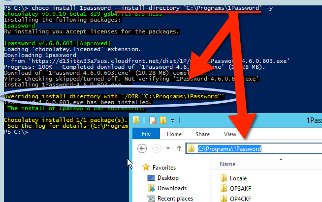
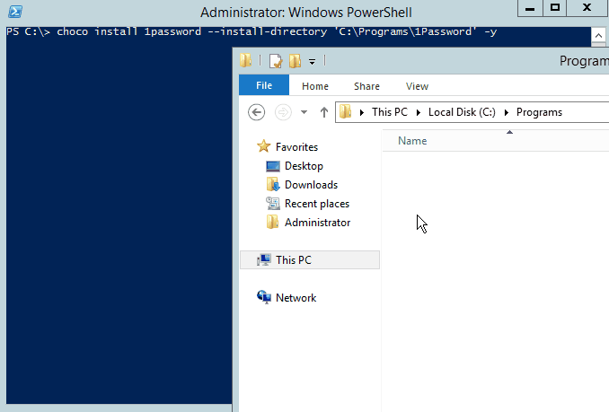

# Install Directory Override (Licensed Editions Only)

The ubiquitous install directory switch for [customers](https://chocolatey.org/pricing)! The only switch you will ever need for overriding the install directory for native installers! When working with packages that use native installers (software that actually installs on a machine), Chocolatey is able to override the default installation directory from a simple switch you pass to choco.

It can be a pain determining the native installer type (MSI, NSIS, InnoSetup, etc) for a piece of software and then determining what the what the install directory argument should look like.

With the ubiquitous switch, you are not only saving time, but also possible errors in passing the wrong arguments to an installer!

## Usage

Just pass `--install-directory=value` along and Chocolatey will determine what the actual call to the native installer needs to be and manage that for you!

## See It In Action

## Options and Switches

The following options are added to install and upgrade commands.

~~~sh
   --dir, --directory, --installdir, --installdirectory, --install-dir,
   --install-directory=VALUE
   Install Directory Override - Override the default installation
    directory. Chocolatey will automatically determine the type of
    installer and pass the appropriate arguments to override the install
    directory. The package must use Chocolatey install helpers and be
    installing an installer for software. Available in 0.9.10+. Licensed
    versions only.
~~~

## FAQ

### How do I take advantage of this feature?
You must have a [licensed edition of Chocolatey](https://chocolatey.org/pricing) (Pro and/or Business). Pro is a personal, named license that costs about the price of a lunch outing per month and comes with several other features. Business editions are great for organizations that need more business friendly features from their software management tool.

### I'm a licensed customer, now what?
You just create a package or find a package you want to install that uses a native installer (ends up in Programs and Features).

### How does it work?
Chocolatey is able to inspect the installer file to learn what it is and can do this for almost 15 different types of installers (there are over 20)! Once it understands what type of file it is, it knows how to install/upgrade/uninstall that piece of software.

The recommended calls for installing native installers are to use `Install-ChocolateyPackage` (or `Install-ChocolateyInstallPackage`). This allows Chocolatey to override that directory automagically.

### Do you have plans to make this work for zip files?
We do have plans to extend this to archive packages as well.

