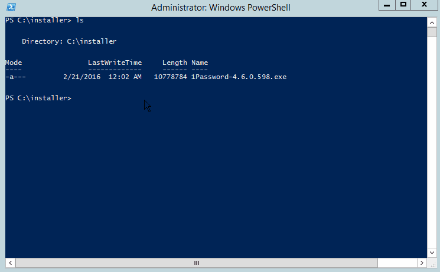
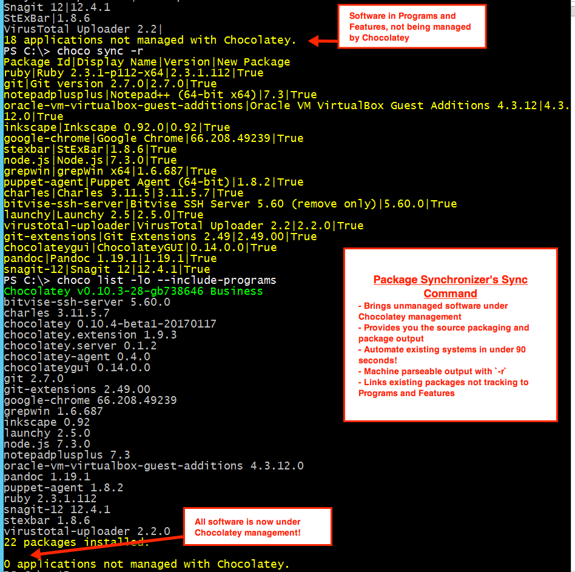
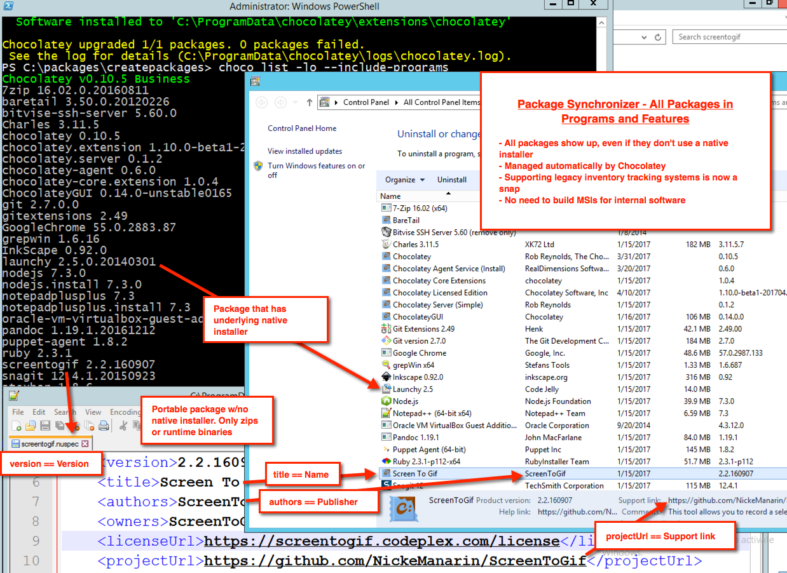

# Synchronize with Programs And Features (Licensed Editions Only)

Chocolatey maintains its own state of the world, while Windows maintains the state of Programs and Features. If an application is upgraded or uninstalled outside of Chocolatey, such as is the case with Google Chrome and its auto updating utility, Chocolatey doesn't know about the change. The synchronize feature keeps Chocolatey's state in sync with Programs and Features, removing possible system-installed state drift.

* [Automatic Sync (All Licensed Editions)](#automatic-synchronize)
* [Synchronize Command](#sync-command) (Business edition only until Q3 2017)
* [All Packages in Programs And Features (C4B)](#all-packages-in-programs-and-features)

---

<!-- TOC -->

- [Automatic Synchronize](#automatic-synchronize)
  - [Usage](#usage)
  - [See It In Action](#see-it-in-action)
  - [Options and Switches](#options-and-switches)
  - [FAQ](#faq)
    - [How do I take advantage of this feature?](#how-do-i-take-advantage-of-this-feature)
    - [I'm a licensed customer, now what?](#im-a-licensed-customer-now-what)
    - [How does it work?](#how-does-it-work)
- [Sync Command](#sync-command)
  - [Usage](#usage-1)
    - [Setup](#setup)
  - [See it in action](#see-it-in-action)
  - [Options and Switches](#options-and-switches-1)
  - [FAQ](#faq-1)
    - [How do I take advantage of this feature?](#how-do-i-take-advantage-of-this-feature-1)
    - [I'm a business customer, now what?](#im-a-business-customer-now-what)
    - [How does it work?](#how-does-it-work-1)
    - [Do I get the packages to add to source?](#do-i-get-the-packages-to-add-to-source)
    - [Some packages have a TODO list](#some-packages-have-a-todo-list)
    - [How do I get machine parseable output?](#how-do-i-get-machine-parseable-output)
    - [What if I have an existing package that is just not tracking to Programs and Features?](#what-if-i-have-an-existing-package-that-is-just-not-tracking-to-programs-and-features)
  - [Sync Command Known issues](#sync-command-known-issues)
- [All Packages in Programs and Features](#all-packages-in-programs-and-features)
  - [Usage](#usage-2)
  - [Requirements](#requirements)
  - [Setup](#setup-1)
  - [Options and Switches](#options-and-switches-2)
  - [FAQ](#faq-2)
    - [How do I take advantage of this feature?](#how-do-i-take-advantage-of-this-feature-2)
    - [I'm a business customer, now what?](#im-a-business-customer-now-what-1)
    - [How does it work?](#how-does-it-work-2)
  - [Packages in Programs and Features Known Issues](#packages-in-programs-and-features-known-issues)

<!-- /TOC -->

## Automatic Synchronize
In licensed editions of Chocolatey, synchronize for existing packages that are tracking to software installed in Programs and Features happens automatically and takes effect prior to the command running.

### Usage

<!--
Text in the image above:

Synchronize with Programs and Features

- Chocolatey for Business - any Chocolatey command will trigger synchronization
- Synchronizes state between Chocoaltey and Programs and Features
- Currently supports manual software removals
- Adding upgrade tracking

This image shows running `choco list -lo`. Chocolatey for Business automatically detects that 1Password has been manually uninstalled and synchronizes Chocolatey's state.
-->

### See It In Action

### Options and Switches

There are none - automatic sync just happens every run.

### FAQ

#### How do I take advantage of this feature?
You must have a [licensed edition of Chocolatey](https://chocolatey.org/pricing) (Pro, MSP, or Business). Pro is a personal, named license that costs about the price of a lunch outing per month and comes with several other features. Business editions are great for organizations that need to manage the total software management lifecycle. MSP editions contain a subset of the Business edition features.

#### I'm a licensed customer, now what?
It just works.

#### How does it work?
Chocolatey tracks applications that it installs, so it is able to keep up with those applications as they are upgraded and uninstalled, even outside of Chocolatey.

## Sync Command

Starting in 1.9.0 of the licensed extension, sync has been added as a preview feature for organizations to try out. Currently Business edition only, but expected to be in Pro+ in Q3 2017.

Sync looks at all software that is in Programs and Features that is not being managed with Chocolatey packages and brings them under management. This means you can run one command and suddenly, all of the software installed on a machine is under management by Chocolatey!

### Usage

To synchronize your system, Simply call `choco sync` and Chocolatey will ensure that all software in Programs and Features comes under Chocolatey management and provides you the packages/package sources so you can add them to source control for managing those packages over time.

#### Setup
At 1.9.0, sync is in preview. You need to turn it on by enabling the feature  `allowPreviewFeatures`:

* `choco feature enable -n allowPreviewFeatures`

### See it in action

We've prepared a short video to show sync in action:

In the following image, sync is run on a system that has 18 applications installed and a base Chocolatey for Business install. Note after running sync, all software on the machine is now being managed by Chocolatey.

<!--
Text in the image above:

Package Synchronizer's Sync Command

- Brings unmanaged software under Chocolatey management
- Provides you the source packaging and package output
- Automate existing systems in under 90 seconds!
- Machine parseable with `-r`
- Links existing packages not tracking to Programs and Features

This image shows running `choco sync`. It shows first a system that has 18 applications installed outside of Chocolatey, then runs `choco sync` and watches Chocolatey generate packages and baseline the system. Then it shows `choco list -lo --include-programs` again, which shows that all software on the machine is now being managed by Chocolatey.

-->

### Options and Switches

The following are available in the [[choco sync|CommandsSync]] command.

~~~
     --id=VALUE
     Id - The Display Name from Programs and Features

     --out, --outdir, --outputdirectory, --output-directory=VALUE
     OutputDirectory - Specifies the directory for the generated Chocolatey
       package file(s). If not specified, uses a subdirectory of the current
       directory.
~~~

### FAQ

#### How do I take advantage of this feature?
You must have the [business edition of Chocolatey](https://chocolatey.org/pricing). Business editions are great for organizations that need to manage the total software management lifecycle.

#### I'm a business customer, now what?
You would periodically run `choco sync`.

#### How does it work?
Chocolatey takes a look at all software in Programs and Features that is not under Chocolatey management, generates packages on the fly and baselines them under the Chocolatey install, ensuring all of the links are tracked.

#### Do I get the packages to add to source?
Yes! Chocolatey will tell you the location of the sync files so you can put them into source control.

#### Some packages have a TODO list
Generating packages on the fly from Programs and Features for non-MSI installers doesn't provide everything necessary to ensure an actual install. So when you take those packages back to source, you will need to finish out the packaging for those so that later when you upgrade, things will work appropriately.

#### How do I get machine parseable output?
Use `-r`. `choco sync -r`. Requires Chocolatey v0.10.4+.

#### What if I have an existing package that is just not tracking to Programs and Features?
Synchronize can recognize existing packages and sync to those as long as the name of the package is a close match to the software name (e.g. Google Chrome becomes either google-chrome or googlechrome).

### Sync Command Known issues
* Any packages you've installed side by side (`-m`) will show up every time during sync.
* If you have both a 64-bit and 32-bit version of some software installed, sync will track to one on the first run and the other on the next run. This is not a normal scenario.

## All Packages in Programs and Features
In C4B, you can flip a switch and see all packages in Programs and Features, even those packages that don't have underlying native installers! This makes reporting back to legacy inventory reporting systems a snap.

### Usage

<!--
Text in the image above:

Package Synchronizer - All Packages in Programs and Features

- All packages show up, even if they don't use a native installer
- Managed automatically by Chocolatey
- Supporting legacy inventory tracking systems is now a snap
- No need to build MSIs for internal software

This image shows a display of `choco list -lo` side by side with Programs and Features. It links a package with a native installer (Launchy) to show that it didn't do anything differently. It links a package that uses a zip archive (Screen To Gif), shows part of the nuspec file and how that all maps to the Programs and Features entry.
-->

### Requirements

* Chocolatey (`chocolatey` package) v0.10.7+.
* Chocolatey for Business (C4B) Edition.
* Chocolatey Licensed Extension (`chocolatey.extension` package) v1.10.0+.

### Setup

* `choco feature enable -n showAllPackagesInProgramsAndFeatures`

### Options and Switches

 Global Feature Setting:

 * `showAllPackagesInProgramsAndFeatures` - Package Synchronizer's Packages In Programs And Features Synchronization - Show all packages in Programs and Features, not just packages that use a native installer.

### FAQ

#### How do I take advantage of this feature?
You must have the [business edition of Chocolatey](https://chocolatey.org/pricing). Business editions are great for organizations that need to manage the total software management lifecycle.

#### I'm a business customer, now what?
Once you set the feature, it just works automatically.

#### How does it work?
Chocolatey tracks packages that manage natively installed software. For packages that are zip archives or configuration, Chocolatey will add an entry into Programs and Features based on the nuspec. It's smart enough not to add an entry for a meta-package - say `notepadplusplus` and `notepadplusplus.install` are installed. The meta-package would be `notepadpluplus`.

### Packages in Programs and Features Known Issues
* MSU type packages will show up - Chocolatey doesn't automatically track Windows Updates types of installers. So if you install WMF 5 through Chocolatey and turn this feature on, it will show up as well.
* You must run choco at least one more time after setting the feature for it to take effect. So flip the feature and then run `choco -v`.
