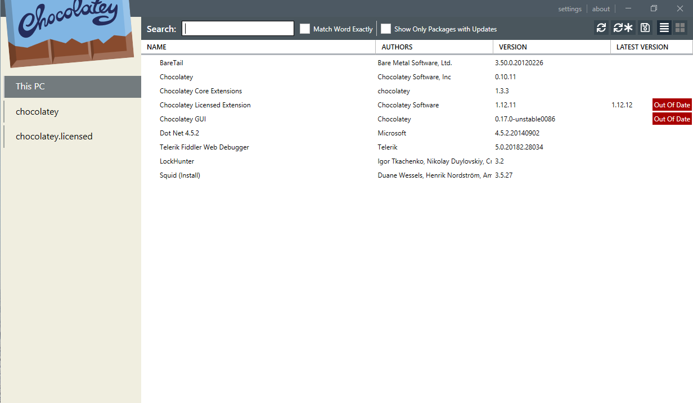
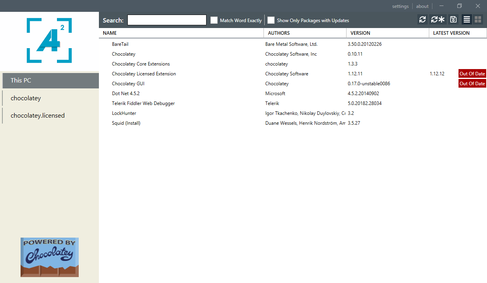
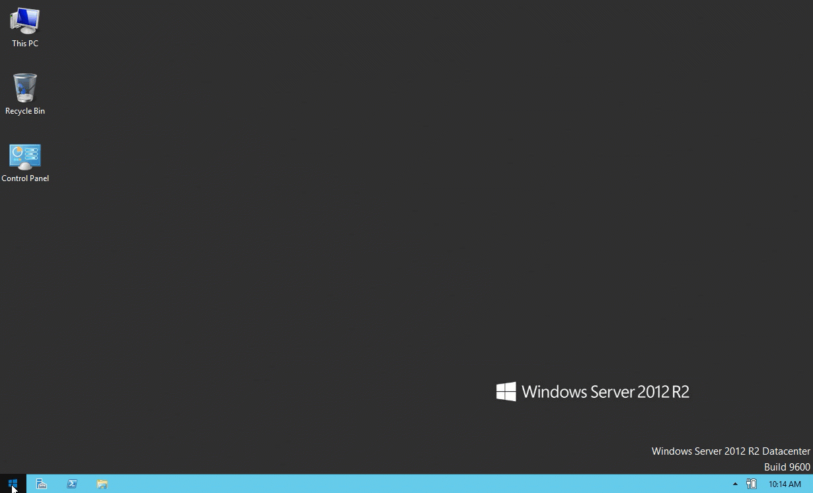
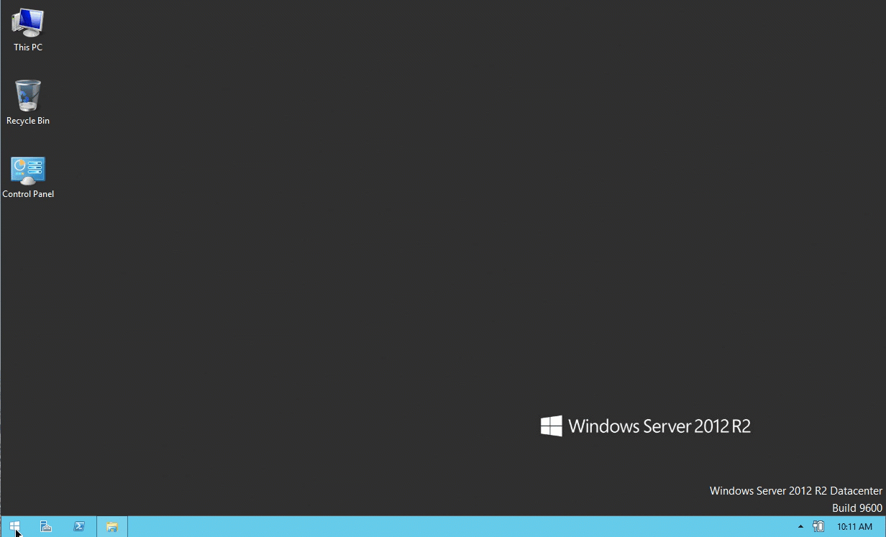

# What is Chocolatey GUI?

Chocolatey GUI is a WPF application that allows the installation, uninstallation,
updating, and searching for Chocolatey Packages.  It is intended as a replacement
for the Chocolatey CLI for those that prefer interacting with an application,
rather than with commands.

# What functionality is offered by Chocolatey GUI?

While Chocolatey GUI has a number of pieces of functionality, is doesn't have
everything that is offered by the Chocolatey CLI.  Over time, additional functionality
will likely be added, but for the time being, the following is possible in
Chocolatey GUI:

* List Chocolatey Packages installed on local machine
* List Chocolatey Packages available for installation from remote sources
* Install/Uninstall/Update/Pin/Unpin Chocolatey Packages
* Add/Remove Chocolatey Sources
* Enable/disable Chocolatey Features
* Modify Chocolatey configuration values
* Visual indications provided when installed Chocolatey Packages are out of date
* List and Tile View of installed/available packages

# Branding

We are aware that some of customers want to be able to brand Chocolatey GUI so
that is "looks" like their own internal applications.  Out of the box, Chocolatey
GUI's main screen looks like this:

However, with branding applied, Chocolatey GUI's main screen can instead look like
this:

Here, the logo of a company called A Squared Software Ltd is being used, instead
of the main Chocolatey logo.  In addition, a _Powered By Chocolatey_ logo is added
to the bottom left corner of the application.

## Requirements for branding

**NOTE:** Branding of Chocolatey GUI will only available to our Business License
customers, and requires a special build of Chocolatey GUI.  The version of Chocolatey
GUI that ships on the Chocolatey Community Repository does not include the
ability to apply branidng.  If you would like more information about the branded
version of Chocolatey GUI, please reach out to support via the normal channels.

In order for branding to work, there are a number of image files that are required.
These have to be named exactly as the following:

* icon_256x256.ico
* logo_150_250.png
* splash_700x302.png
* splash_975_421.png
* splash_1250x540.png

**NOTE:** The reason that there are multiple splash screen images is because
Chocolatey GUI makes a decision, based on the resolution of the screen, which
splash screen image to display to the user.

The numbers in the file names are a suggestion as to the width and height of each
image.  While the images don't have to _exactly_ match these dimensions, it is
recommended that they are as close as possible to these dimensions.

## Location of branding files

In order for your custom branding files to be applied, you must place the above
files into one of two specific places.

### Default Location

By default, Chocolatey GUI will look for custom branding files in the Chocolatey
installation directory (normally `c:/programdata/chocolatey`, and then in a folder
called `branding/gui`.  i.e. it will look in the following folder:

`c:/programdata/chocolatey/branding/gui`

### Customer Location

It is possible to use a custom location by first settings an environment variable
called `ChocolateyBrandingLocation` to a new location.  For example, if you created
this environment variable with a value of `c:/temp/branding`, then Chocolatey GUI
would then expect to find the above asset files in this location:

`c:/temp/branding/gui`

## ChocolateyGuiBranding.dll

The first time a Business Licensed version of Chocolatey GUI is executed, and there
are the above asset files in one of the defined locations, a new file will
be generated in the same location called `ChocolateyGuiBranding.dll`.  The new
file actually contains all the image files that were created, as they have been
embedded as resouces within this assembly file.  This approach is used in order to
optimize the loading of the assets.  Once this ChocolateyGuiBranding.dll has been
created, Chocolatey GUI will use it each time the application runs.  The original
image asset files are actually no longer required, and can be removed.  If at any
point you need to re-generate the branding that is being used, simply delete the
following two files:

* ChocolateyGuiBranding.dll
* ChocolateyGuiBranding.resources

Then update, your image asset files, and re-run Chocolatey GUI and the branding
assembly will be re-generated.

Using a single ChocolateyGuiBranding.dll as the source of branding makes it very
simple to generate and distribute this assembly to apply branding across your
entire organisation.

# Branding in action

The below GIF shows the default opening of the Chocolatey GUI application when
there is no branding applied.

In this GIF, we see branding being applied to the Chocolatey GUI application.

Notice that the splash screen image has been replaced, as well as the logo at the
top left of the application, and the icon in the taskbar.

# Deploying Branding

What follows is a suggestion on how a branded version of Chocolatey GUI can be
deployed out to your environment.

**NOTE:** In order for the below to work, you must have the privately released
version of Chocolatey GUI, not the version that is available on the Chocolatey
Community Repository.  In addition, this package must be available on the same
source as the package that is produced below.

1. Follow the steps above to place the branding image assets into the correct location.
1. Run the Chocolatey GUI application to generate the ChocolateyGuiBranding.dll
1. Create a new folder on your file system to house the branding Chocolatey Package
1. In this folder, create a `tools` folder
1. Copy the generated `ChocolateyGuiBranding.dll` into this folder
1. Copy the following xml into a file called `chocolateygui-branding.nuspec`.
    ~~~xml
    <?xml version="1.0" encoding="utf-8"?>
    <package xmlns="http://schemas.microsoft.com/packaging/2015/06/nuspec.xsd">
      <metadata>
        <id>chocolateygui-branding</id>
        <version>0.1.0</version>
        <title>chocolateygui-branding (Install)</title>
        <authors>__REPLACE_AUTHORS_OF_SOFTWARE_COMMA_SEPARATED__</authors>
        <projectUrl>https://_Software_Location_REMOVE_OR_FILL_OUT_</projectUrl>
        <tags>chocolateygui-branding SPACE_SEPARATED</tags>
        
__REPLACE__

        <description>__REPLACE__MarkDown_Okay </description>
        <dependencies>
          <dependency id="chocolateygui" />
        </dependencies>
      </metadata>
      <files>
        <file src="tools\**" target="tools" />
      </files>
    </package>
    ~~~
1. Copy the following PowerShell into a file called `tools\chocolateyInstall.ps1`
    ~~~powershell
    $toolsDir                      = "$(Split-Path -parent $MyInvocation.MyCommand.Definition)"
    $helpersFile                   = Join-Path -Path $toolsDir -ChildPath 'helpers.ps1'

    . $helpersFile

    $chocolateyGuiBrandingAssembly = Join-Path -Path $toolsDir -ChildPath 'ChocolateyGuiBranding.dll'
    $chocolateyGuiBrandingLocation = Join-Path -Path (Get-BrandingLocation) -ChildPath 'gui'

    if(!(Test-Path -Path $chocolateyGuiBrandingLocation)){
      New-Item $chocolateyGuiBrandingLocation -ItemType Directory -Force | Out-Null
    }

    Copy-Item -Path $chocolateyGuiBrandingAssembly -Destination $chocolateyGuiBrandingLocation
    ~~~
1. Copy the following PowerShell into a file called `tools\chocolateyuninstall.ps1`
    ~~~powershell
    $toolsDir                      = "$(Split-Path -parent $MyInvocation.MyCommand.Definition)"
    $helpersFile                   = Join-Path -Path $toolsDir -ChildPath 'helpers.ps1'

    . $helpersFile

    $chocolateyGuiBrandingLocation = Join-Path -Path (Get-BrandingLocation) -ChildPath 'gui'
    $chocolateyGuiBrandingAssembly = Join-Path -Path $chocolateyGuiBrandingLocation -ChildPath 'ChocolateyGuiBranding.dll'

    Remove-Item -Path $chocolateyGuiBrandingAssembly -Force -ErrorAction Continue | Out-Null
    ~~~
1. Copy the following PowerShell into a file called `tools\helpers.ps1`
    ~~~powershell
    function Get-BrandingLocation {
      <#
      .SYNOPSIS
      Gets the top level location for branding files used by Chocolatey
      applications
      .DESCRIPTION
      Creates or uses an environment variable that a user can control to
      communicate with packages about where they would like branding files to
      be located.
      .NOTES
      Sets an environment variable called `ChocolateyBrandingLocation`.
      .INPUTS
      None
      .OUTPUTS
      None
      #>

        $brandingLocation = $env:ChocolateyBrandingLocation

        if ($null -eq $brandingLocation) {
          $chocoInstallLocation = $env:ChocolateyInstall
          $brandingLocation = Join-Path -Path $chocoInstallLocation -ChildPath 'branding'
        }

        # Add a drive letter if one doesn't exist
        if (-not($brandingLocation -imatch "^\w:")) {
          $brandingLocation = Join-Path $env:systemdrive $brandingLocation
        }

        if (-not($env:ChocolateyBrandingLocation -eq $brandingLocation)) {
          try {
            Set-EnvironmentVariable -Name "ChocolateyBrandingLocation" -Value $brandingLocation -Scope User
          } catch {
            if (Test-ProcessAdminRights) {
              # sometimes User scope may not exist (such as with core)
              Set-EnvironmentVariable -Name "ChocolateyBrandingLocation" -Value $brandingLocation -Scope Machine
            } else {
              throw $_.Exception
            }
          }
        }

        return $brandingLocation
        }
    ~~~
1. Run the command `choco pack`
1. Deploy the generated `chocolateygui-branding.nupkg` to the repository that you are using
1. Install the Chocolatey GUI Branding package
