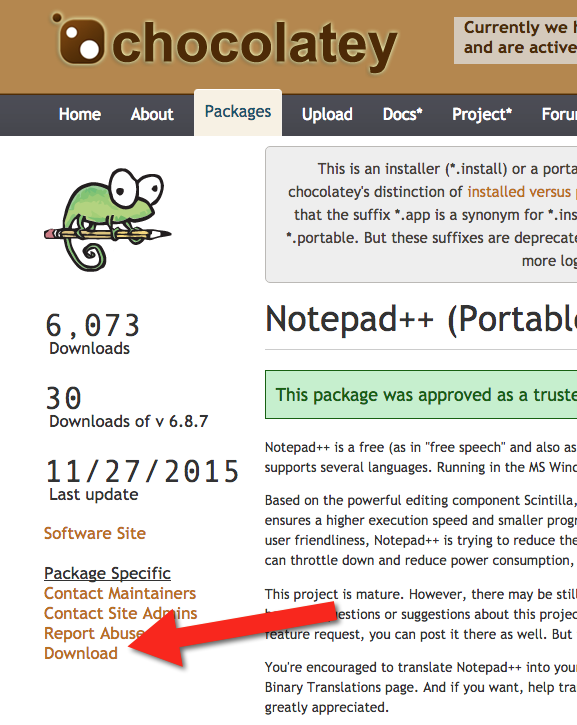
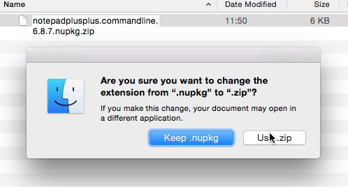
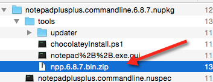

# How To Internalize/Recompile Packages

<!-- TOC -->

- [What is it? Why?](#what-is-it-why)
- [Process of Internalization](#process-of-internalization)
- [How to Internalize An Existing Package Automatically](#how-to-internalize-an-existing-package-automatically)
- [How To Internalize/Recompile An Existing Package Manually](#how-to-internalizerecompile-an-existing-package-manually)

<!-- /TOC -->

## What is it? Why?
Sometimes creating packages from scratch can be an involved process. Not all software installers are created equal (and not all are easily automated either)! Thankfully there is already a tremendous resource you can use to make the process of getting your software all packaged up even smoother.

On [chocolatey.org](https://chocolatey.org), you will find packages with all of the install logic you need to automatically install your software. However, many of these publicly available packages also rely on software that is available from official distribution points because they are subject to [software licensing and copyright law](https://en.wikipedia.org/wiki/Software_license). Unless you’re granted the right to distribute the software via the license, you can’t redistribute it publicly. These laws do not apply when you use internal packages, and that is a good thing!

Why? Downloading software from the internet creates a failure point because it may not be available, the software vendor site could go down, etc. With internal packages, you don’t have to worry about any of that. You can create internal packages and embed the software directly in the package and/or use internal file shares.

This is where recompiling packages comes in. Recompiling a package lets you take an existing package and internalize all of the resources to embedded/internal resources so you can reuse the install logic without the hassle of downloading stuff from the internet. This guarantees complete control, trust, reliability, and repeatability of a package for organizations that have a low tolerance for production issues.

## Process of Internalization

Internalizing a Chocolatey package at a high level involves:

 1. Downloading and unpacking the existing package as a zip file.
 1. Downloading the resources the package has and putting them in the package or somewhere internal ([[UNC, internal Http repository, DFS|How-To-Host-Feed]], [[SCCM Distribution point|FeaturesInfrastructureAutomation]], etc).
 1. Editing the install script to point to the internal/embedded software.
 1. Packaging it back up (recompiling).
 1. Pushing it to your internal server.
 1. And that’s it!

Recompiling is a great way to quickly get your organization up to speed on managing software with Chocolatey packages.

## How to Internalize An Existing Package Automatically

See [[Package Internalizer - Automatically Internalize/Recompile Packages|FeaturesAutomaticallyRecompilePackages]].

 * Have Chocolatey for Business (or Chocolatey for MSP).
 * Call a command like the following:
    * `choco download notepadplusplus.commandline --internalize`
    * `choco download git.install --internalize --resources-location \\unc\share`
    * `choco download nodejs.install --internalize --resources-location http://some/internal/url --internalize-all-urls`.
 * That's it! It does all of the manual steps below in a fraction of the time.

Package Internalizer can be hooked up to continuous integration automation or scheduled tasks to really reduce manual work.

## How To Internalize/Recompile An Existing Package Manually

Chocolatey's [community feed](https://chocolatey.org/packages) has quite a few packages but they are geared towards community and use the internet for downloading from official distribution sites due to copyright law and a publicly offered repository. However, they are attractive as they have everything necessary to install a piece of software on your machine. Through the internalization process, by which you take a community package and bring all of the bits internal and/or embed them into the pacakge, you can convert an existing package to be 100% offline and reliable and host it on an internal Chocolatey repository. This gives you complete control over a package and removes the aforementioned production trust and control issues.

To make the existing package local, use these steps.

`1.` Download the package from Chocolatey's community feed by going to the [package page](https://chocolatey.org/packages/notepadplusplus.commandline) and clicking the download link.

`2.` Rename the downloaded file to end with `.zip` and unpack the file as a regular archive.

`3.` Delete the `_rels` and `package` folders and the `[Content_Types].xml` file. These are created during `choco pack` and should not be included, as they will be regenerated (and their existence leads to issues).

`4.` Next, open `tools\chocolateyInstall.ps1`.

~~~powershell
Install-ChocolateyZipPackage 'notepadplusplus.commandline' 'https://notepad-plus-plus.org/repository/6.x/6.8.7/npp.6.8.7.bin.zip' "$(Split-Path -parent $MyInvocation.MyCommand.Definition)"
~~~

`5.` Download the zip file and place it in the tools folder of the package.

`6.` If the file ends in `.exe`, create an empty file called `*.exe.ignore`, where the name is an exact match with the exe with `.ignore` appended at the end (e.g. `bob.exe` would have a file next to it named `bob.exe.ignore`).

`7.` Next, edit `chocolateyInstall.ps1` to point to this embedded file instead of reaching out to the internet (if the size of the file is over 100MB, you might want to put it on a file share somewhere internally for better performance).

~~~powershell
$toolsDir   = "$(Split-Path -parent $MyInvocation.MyCommand.Definition)"
Install-ChocolateyZipPackage 'notepadplusplus.commandline' "$toolsDir\npp.6.8.7.bin.zip" "$toolsDir"
~~~

The double quotes allow for string interpolation (meaning variables get interpreted instead of taken literally).

`8.` Next, open the `*.nuspec` file to view its contents and make any necessary changes.

~~~xml
<?xml version="1.0"?>
<package xmlns="http://schemas.microsoft.com/packaging/2010/07/nuspec.xsd">
 <metadata>
   <id>notepadplusplus.commandline</id>
   <version>6.8.7</version>
   <title>Notepad++ (Portable, CommandLine)</title>
   <authors>Don Ho</authors>
   <owners>Rob Reynolds</owners>
   <projectUrl>https://notepad-plus-plus.org/</projectUrl>
   <iconUrl>https://cdn.rawgit.com/ferventcoder/chocolatey-packages/02c21bebe5abb495a56747cbb9b4b5415c933fc0/icons/notepadplusplus.png</iconUrl>
   <requireLicenseAcceptance>false</requireLicenseAcceptance>
   <description>Notepad++ is a ... </description>
   
Notepad++ is a free (as in "free speech" and also as in "free beer") source code editor and Notepad replacement that supports several languages. 

   <tags>notepad notepadplusplus notepad-plus-plus</tags>
 </metadata>
</package>
~~~

Some organizations will change the version field to denote this is an edited internal package, for example changing `6.8.7` to `6.8.7.20151202`. For now, this is not necessary.

`9.` Now you can navigate via the command line to the folder with the `.nuspec` file (from a Windows machine unless you've installed Mono and built choco.exe from source) and use `choco pack`. You can also be more specific and type `choco pack path\to\notepadplusplus.commandline.nuspec`. The output should be similar to below.

~~~sh
Attempting to build package from 'notepadplusplus.commandline.nuspec'.
Successfully created package 'notepadplusplus.commandline.6.8.7.nupkg'
~~~

`10.` Normally you test on a system to ensure that the package you just built is good prior to pushing the package (just the *.nupkg) to your internal repository. This can be done by using `choco.exe` on a test system to install (`choco install notepadplusplus.commandline -source .`) and uninstall (`choco uninstall notepadplusplus.commandline`).

**NOTE:** Originally posted at https://puppet.com/blog/chocolatey-creating-recompiled-packages and https://docs.puppet.com/pe/latest/windows_modules.html
